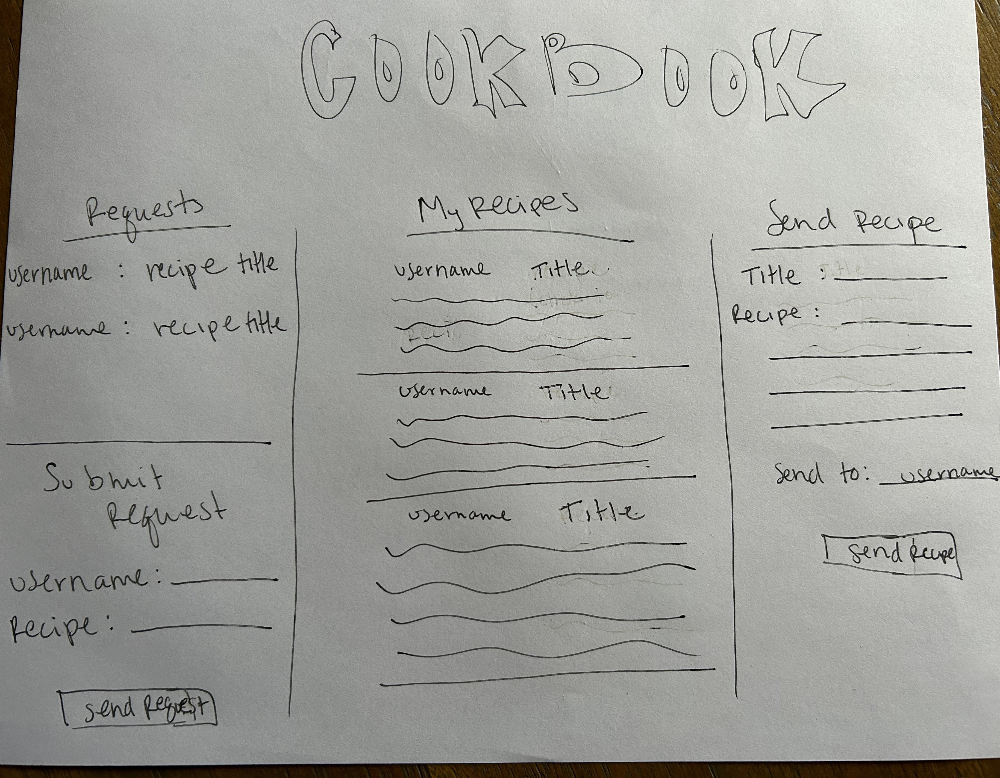

# Cookbook
## Description deliverable
### Elevator pitch
Last week I called my mom to ask for her pumpkin bread recipe... AGAIN. This happens around this time every year, but it doesn't need to. With Cookbook, users can easily share recipes with other users and request recipes from other users. Now, I don't need to call my mom every fall to get the same pumpkin bread recipe. Instead, I can surprise her with a freshly made loaf.
### Design

### Key features
- Secure login
- Ability to create recipe requests.
- Ability to share recipes with other users.
### Technologies
- **HTML** - Uses correct HTML structure. One page for login, one for user recipes, one for sending recipes, and one for requesting recipes.
- **CSS** - Style application to look good accross various devices and screen sizes, use good whitespace, and have good color contrast.
- **JavaScript** - Provide login, display recipes, display option to send/request recipes from other users, display recipe requests. 
- **Web Service** - Backend service with endpoints for:
   - login
   - retrieving recipe requests
   - submitting recipes
   - retrieving recipes
- **Authentication** - Register and login users. Securely store credentials in database. Require authentication to send and request recipes.
- **Database persistence** - Store users, recipes, and requests in database.
- **WebSocket** - As a user shares a recipe, the recipe is broadcast to the intended recipient.
- **Web Framework** - Application ported to use the React web framework.

## HTML Deliverable

I used HTML to build the basic structure of my application.

- **HTML pages** - Four HTML pages that represent the ability to log in and send and receive recipes.
- **Links** - The login in page automatically links to the recipe page. The recipe page has links for the send and request pages. The send page has links for the recipe and request pages. The request page has links for the recipe and send pages.
- **Text** - Each of the recipes and recipe requests are represented by text.
- **Images** - I included an image in the header of each page.
- **Login** - Input box and submit button for login.
- **Database** - The recipe page represents data pulled from the database.
- **WebSocket** - The received requests and sent recipes represent the realtime communication.

## CSS Deliverable

I used CSS to style my application.

- **Header, footer, and main content body** - I changed the sizes of my header, footer, and main content body to better fit the appearance that I wanted my application to have. I also changed the background color and text color of my header and footer.
- **Navigation elements** - I changed the spacing and color of my navigation elements. I also got rid of the underlines beneath the navigation elements.
- **Responsive to window resizing** - I used flex to make sure that my application would look good on different window sizes.
- **Application elements** - I formatted all of my buttons and my table with the placeholders for recipe requests, and I added an accordion to better organize the user's recipe collection. I picked a good color scheme and used whitespace well.
- **Application text content** - My fonts are consistent. Text size and color changes based on where the text is found.
- **Application images** - I formatted the image found in the header to cover the width of the entire header. I changed the size so it adds to the aesthetics of the application without drawing away too much attention from application content.

## JavaScript Deliverable

I used JavaScript to make the application work for a user. I also added placeholders for future features.

- **Login** - Pressing the login button takes the user to their "My Recipes" page where their username is displayed at the top.
- **Database** - User's recipes are displayed, as well as all unfulfilled recipe requests from other users. Right now this uses local storage and serves as a placeholder for database data.
- **WebSocket** - I implimented my recipe request form and my submit request form as placeholders. In the future, Websocket will be used as a way to allow users to receive new recipes and new recipe requests in real time.
- **Application logic** - Recipes are added to the user's recipe list in the order that they're received. Requests are also added to the requests table in the order that they're received. When a user sends a recipe that fulfills a recipe request, the recipe request is removed from their requests list.

## Service Deliverable

For this deliverable I added backend web service support and interaction.

- **Create an HTTP service using Node.js and Express** - done.
- **Static Middleware** - done.
- **Third Party Endpoints** - I added a spot on the login page for a link to a video of a random recipe that users see when they go to login.
- **Backend Service Endpoints** - I have placeholders for login information. I have endpoints that receive requests and recipes and return requests and recipes.
- **Frontend Calls Service Endpoints** - This is done using the fetch function.

## DB Deliverable

For this deliverable I stored requests and recipes in the database.

- **MongoDB Atlas database created** - done.
- **Backend Endpoints provided** - Endpoints send data to Mongo after processing.
- **Stores application data in MongoDB** - done.

## Login Deliverable

For this deliverable I added login information and associated recipes and requests with the user.
- **User Registration** - Creates new account with associated username and password in the databse.
- **Existing User Authentication** - If the user already exists, their preexisting recipes and requests load.
- **MongoDB** - used to store the account information, as well as recipes and requests.
- **Restricts Functionality** - Users cannot look at their recipes and requests or send recipes and requests until they're logged in.
